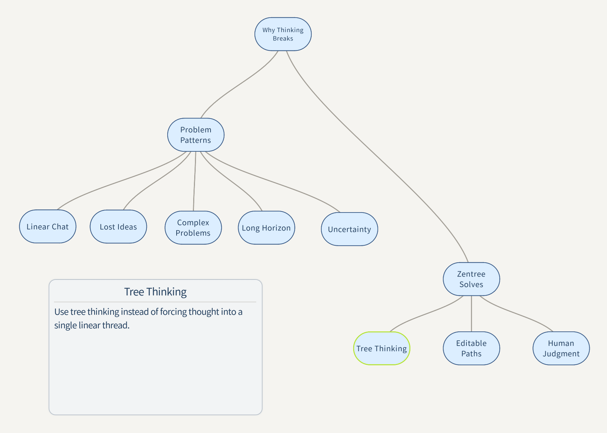
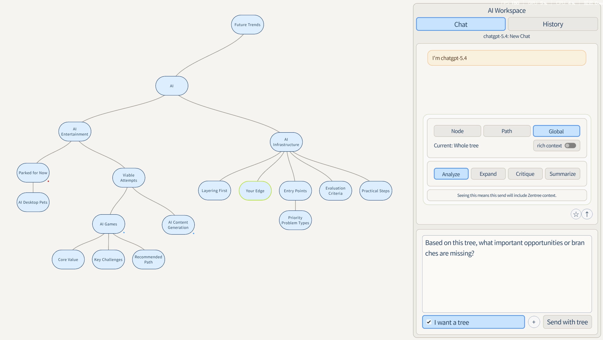
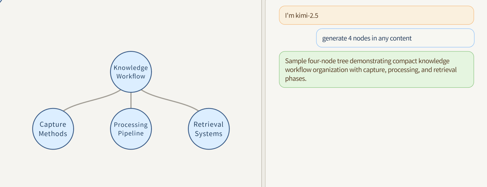

# Zentree

An AI-native thinking workspace built around a tree-based canvas.

## What is Zentree

Zentree is a workspace for exploratory thinking.

It is designed for ideas that do not fit well into a single linear thread: open questions, branching options, evolving plans, and long-running analysis. Instead of treating conversation as the final product, Zentree treats structure as the working surface.

The core interface is a tree. You can expand a line of thought, split it into alternatives, revisit earlier branches, and keep multiple directions visible at once. AI helps generate branches, surface missing angles, and draft structure, while the user remains responsible for judgment, priorities, and the final shape of the work.

## Why not just ChatGPT, notes, or mind maps

Most AI chat tools are optimized for fast, linear exchange. Most note apps are built to store information. Most mind maps are useful for sketching, but are not designed as a serious working environment for AI-assisted reasoning.

Zentree sits in a different place:

- Thinking process comes first, not just answers.
- Tree structure is the main interface, not a side view or export format.
- The user owns the structure and judgment.
- AI helps expand, branch, analyze, critique, and draft.
- It works best for exploratory, non-linear thinking that unfolds over time.

In practice, this makes Zentree better suited to problems where the path is not obvious yet.

## Core workflow

1. Start with a question, topic, or rough direction.
2. Build or grow a tree instead of forcing everything into one thread.
3. Ask AI to generate tree-shaped output when you want structure, not just prose.
4. Use tree context at the node, path, or global level to analyze, expand, critique, or summarize.
5. Keep the parts that matter, revise the branches, and let the structure evolve with your thinking.

## Screenshots

### Product concept

### Real scenario

### AI-generated tree

## Who it is for

Zentree is for people who need to think across branches rather than write toward a single answer.

Typical use cases include:

- exploratory product thinking
- research and synthesis
- strategy work with competing options
- long-horizon planning
- creative development with multiple directions
- AI-assisted reasoning where structure should remain editable

## Current status

This repository is an early public-facing home for Zentree.

The current materials document the product direction, interface ideas, and thinking model. Release assets and packaging may change as the project matures.

Additional source notes are available in [docs](docs/README.md).

## Download / Releases

Published builds will appear on the GitHub Releases page for this repository.

No release package is linked from this README yet.

## License / Source note

No license file is included in this repository at the moment. Until a license is added, please treat the source and assets here as shared for reference rather than general reuse.
